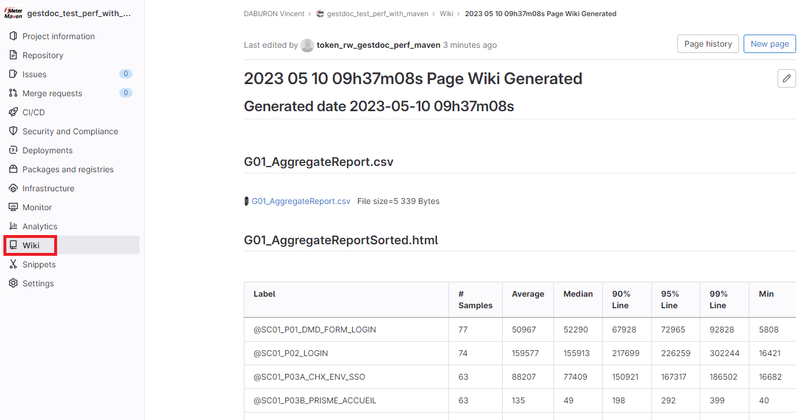
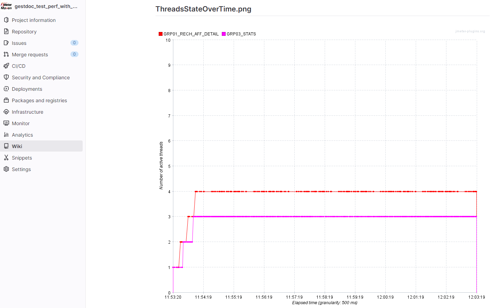

# Generating a Gitlab Wiki Page that references or includes various files
This program recursively scans a directory looking for files of different types to generate a link or include the content in the new generated wiki page.

The types of files searched are:
 * csv
 * jtl
 * xml
 * gz
 * zip
 * log
 * gif
 * png
 * bmp
 * jpg
 * jpeg
 * html
 
The link is "&lt;a ref=" url file attachement in gitlab for files of type: csv, jtl, xml, gz, zip, log (to download it)

The link is "
Example : z.img < dir/x.img < dir/y.img < aa/bb/c.img < aa/bb/d.img
Deep    : no dir, dir 1 deep level,      dir 2 deep level
</pre>

## License
See the LICENSE file Apache 2 [https://www.apache.org/licenses/LICENSE-2.0](https://www.apache.org/licenses/LICENSE-2.0)

## The wiki page generated
Gitlab wiki page extract example 1 :



Gitlab wiki page extract example 2 :



## Usage Maven
The maven groupId, artifactId and version, this plugin is in the **Maven Central Repository**  [](https://maven-badges.herokuapp.com/maven-central/io.github.vdaburon/create-gitlab-wiki-page-for-files-in-directory)

```xml
<groupId>io.github.vdaburon</groupId>
<artifactId>create-gitlab-wiki-page-for-files-in-directory</artifactId>
<version>1.1</version>
```
Just include the plugin in your `pom.xml` and execute `mvn verify` <br>
or with parameters overwriting properties `mvn -DgitlabUrl=https://mygitlab.com -DprojectId=12344 -DaccessToken=SLKJtokenLMJI -DpageTitle="Load test 05_03_2023" verify`<br>
or individual launch `mvn -DaccessToken=mytokenLMJI exec:java@create_gitlab_wiki_page_for_files_in_directory`

```xml

<project>
    <properties>
        <gitlabUrl>https://mygitlab.com</gitlabUrl>
        <projectId>my_project_id_148609</projectId>
        <accessToken>my_access_token_PkJ007</accessToken>
        <graph_width>900</graph_width>
        <dirWithFile>${project.build.directory}/jmeter/results</dirWithFile>
        <pageTitle>Load test 05_03_2023</pageTitle>
    </properties>

    <dependencies>
        <dependency>
            <groupId>io.github.vdaburon</groupId>
            <artifactId>create-gitlab-wiki-page-for-files-in-directory</artifactId>
            <version>1.1</version>
        </dependency>
    </dependencies>

    <build>
        <plugins>
            <plugin>
                <groupId>org.codehaus.mojo</groupId>
                <artifactId>exec-maven-plugin</artifactId>
                <version>1.2.1</version>
                <executions>
                    <execution>
                        <id>create_wiki_page_for_files_in_directory</id>
                        <phase>verify</phase>
                        <goals>
                            <goal>java</goal>
                        </goals>
                        <configuration>
                            <mainClass>io.github.vdaburon.jmeter.utils.WikiPageGenerator</mainClass>
                            <arguments>
                                <argument>-gitlabUrl</argument>
                                <argument>${gitlabUrl}</argument>
                                <argument>-projectId</argument>
                                <argument>${projectId}</argument>
                                <argument>-accessToken</argument>
                                <argument>${accessToken}</argument>
                                <argument>-dirWithFile</argument>
                                <argument>${dirWithFile}</argument>
                                <argument>-imageWidth</argument>
                                <argument>${graph_width}</argument>
                                <argument>-pageTitle</argument>
                                <argument>${pageTitle}</argument>
                            </arguments>
                        </configuration>
                    </execution>
                </executions>
            </plugin>
        </plugins>
    </build>
</project>
```
## Simple jar tool
This tool is a java jar, so it's could be use as simple jar (look at [https://github.com/vdaburon/CreateGitlabWikiPageForFilesInDirectory/releases](https://github.com/vdaburon/CreateGitlabWikiPageForFilesInDirectory/releases) to download jar file)
<pre>
java -jar create-gitlab-wiki-page-for-files-in-directory-&lt;version&gt;.jar -gitlabUrl https://mygitlab.com -projectId 148609 -accessToken WaBcDefNwHzJ44dPkJ007 -dirWithFile C:/result -imageWidth 950
</pre>

## Link to others projects
Usally this plugin is use with [jmeter-graph-tool-maven-plugin](https://github.com/vdaburon/jmeter-graph-tool-maven-plugin)<br>
and this plugin [csv-report-to-html](https://github.com/vdaburon/JMReportCsvToHtml)
1) The **jmeter-graph-tool-maven-plugin** create the report csv files and graphs
2) The **csv-report-to-html** create the **html table report** from the csv file

## Versions
Version 1.1 change default Wiki Page Title and the Date Format to be more compatible with slug link (remove ':')<br>
Version 1.0 initial version test with Gitlab version 15.10

